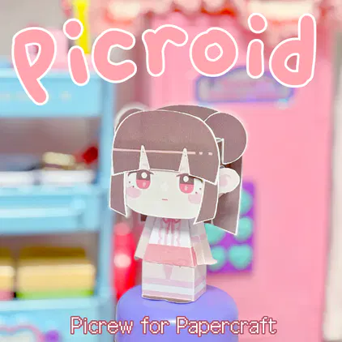

# picroid-repo

> Picrew for Papercraft

페이퍼크래프트 도면을 만드는 메이커입니다. 완성된 도면은 상업적 이용만 아니면 무엇이든 가능합니다.

* 만드실 때는 화상을 다운받아 A4용지에 꽉 차게 인쇄해주시면 됩니다. 
* 앞머리, 뒷머리, 추가파츠 일부는 좌우반전으로 한 장 더 인쇄해서 붙이는 것을 권장합니다.
* 해상도를 올리고 싶으신 경우 waifu2x 등의 프로그램을 이용해주세요.

# 사용범위

* 개인적 이용
* 비상업적 배포
* 전체연령가 수준에서의 가공

# 재배포 허용 범위

모든 재배포는 원작자 및 원작 픽크루 링크를 표기하는 것을 원칙으로 합니다.
* 도면의 빈 공간에 
* 파츠를 추가하여 배포하는 것

# NG!

* 모든 형태의 상업적 이용